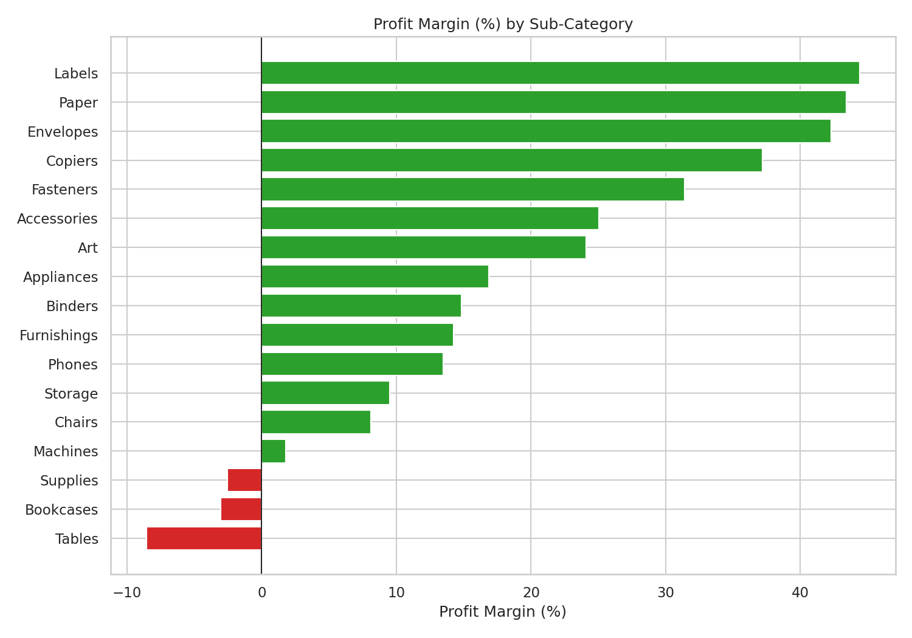
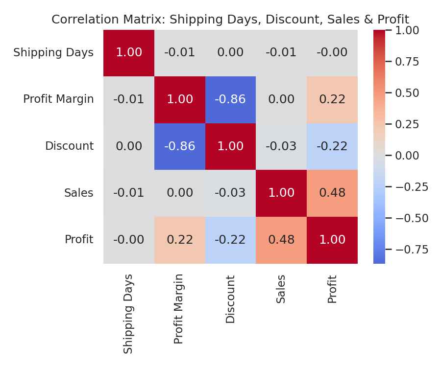
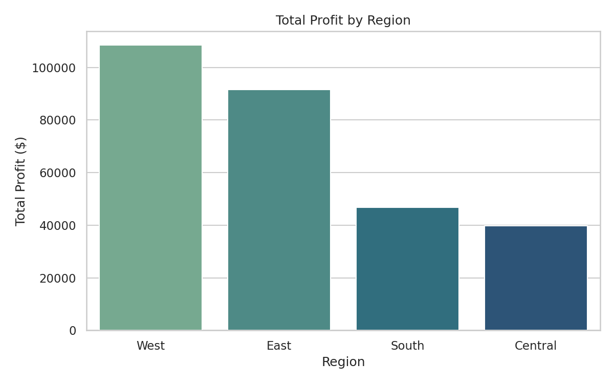
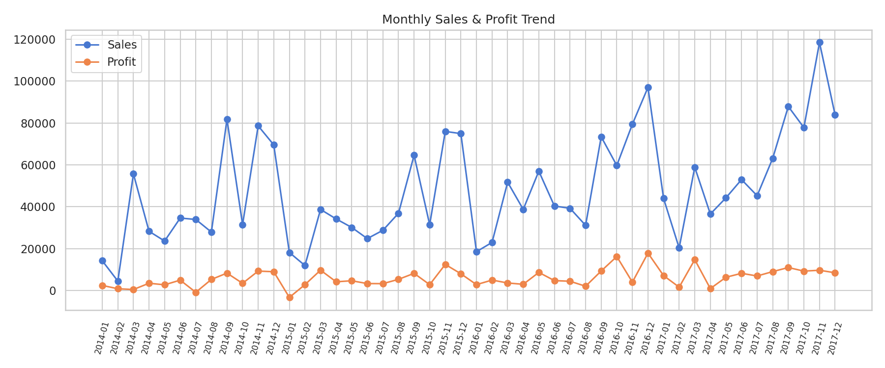

# 🛒 Retail Business Performance & Profitability Analysis

End-to-end data analytics project on the **Sample Superstore** dataset.

Analyzes 9,994 retail transactions to find **profit-draining product categories**, test whether **shipping/inventory lag** affects profitability, and surface **region & discount** insights — using SQL, Python, and an interactive dashboard.

> 📄 Read the full 2-page write-up: [`report/Retail_Profitability_Report.pdf`](report/Retail_Profitability_Report.pdf)

---

## 🎯 Objective

Analyze transactional retail data to uncover profit-draining categories, optimize inventory turnover, and identify seasonal product behavior.

## 🧰 Tools & Stack

| Layer | Tools |
|---|---|
| Data cleaning & aggregation | **SQL** (SQLite) |
| Analysis | **Python** — Pandas, NumPy |
| Static visualization | **Matplotlib, Seaborn** |
| Interactive dashboard | **Plotly** (HTML) |
| Report | **ReportLab** (PDF) |

## 📂 Project Structure

```
retail-project/
├── data/
│   ├── Superstore.csv              # raw dataset (Kaggle)
│   ├── superstore.db                # SQLite DB used for SQL queries
│   └── *.csv                        # generated summary tables
├── sql/
│   ├── queries.sql                  # all SQL analysis queries
│   └── query_results.md             # ⭐ actual output of each query, viewable on GitHub
├── scripts/
│   ├── analysis.py                  # cleaning + EDA + correlation + charts
│   ├── build_dashboard.py           # builds the interactive Plotly dashboard
│   ├── build_report.py              # builds the 2-page PDF report
│   └── build_query_results.py       # captures SQL query output as Markdown
├── images/                          # chart PNGs generated by analysis.py
├── dashboard/
│   └── dashboard.html               # ⭐ open this in a browser
├── report/
│   └── Retail_Profitability_Report.pdf
├── requirements.txt
└── README.md
```

## ▶️ How to Run

```bash
pip install -r requirements.txt

# 1. Clean data, run EDA + correlation analysis, generate chart PNGs
python scripts/analysis.py

# 2. Build the interactive dashboard
python scripts/build_dashboard.py
# then open dashboard/dashboard.html in any browser

# 3. Regenerate the PDF report
python scripts/build_report.py

# 4. Regenerate the SQL query results file (optional — already committed)
python scripts/build_query_results.py
```

SQL queries can be run against `data/superstore.db` with any SQLite client, or adapted to MySQL/PostgreSQL (see comments in `sql/queries.sql`).

> 📋 **Don't want to run the queries yourself?** GitHub only displays `.sql` files as plain text — it doesn't execute them. See [`sql/query_results.md`](sql/query_results.md) for the actual output of every key query, already run and committed as Markdown tables.

## 📊 Dashboard

The interactive dashboard (`dashboard/dashboard.html`) includes KPI cards (Total Sales, Total Profit, Margin, Orders) and charts for profit margin by sub-category, region × category profit, monthly trend, and discount-vs-margin. It's a self-contained HTML file — no server needed, and easy to publish via GitHub Pages.

## 📈 Charts

<table>
<tr>
<td></td>
<td></td>
</tr>
<tr>
<td align="center"><em>Profit margin by sub-category — Tables and Bookcases run negative</em></td>
<td align="center"><em>Discount correlates strongly with margin; shipping days do not</em></td>
</tr>
<tr>
<td></td>
<td></td>
</tr>
<tr>
<td align="center"><em>Profit by region — West and East lead</em></td>
<td align="center"><em>Monthly sales & profit trend</em></td>
</tr>
</table>

## 🔑 Key Findings

- **Furniture is the profitability problem child** — nearly as much revenue as Technology ($742K vs $836K) but only a **2.5% margin** vs 17%+ for Technology and Office Supplies.
- **Tables (−8.6% margin) and Bookcases (−3.0% margin) lose money outright.** Office Supplies > Supplies also runs a small loss.
- **Discounting, not shipping delay, drives lost profit.** Discount correlates strongly negatively with profit margin (**r = −0.86**); shipping/inventory lag has essentially no relationship with margin (**r = −0.01**).
- **West (14.9%) and East (13.5%) regions are most profitable; Central trails at 7.9%** despite solid sales volume.
- Sales and profit are only moderately correlated (**r = 0.48**) — high revenue does not guarantee high profit.

## 💡 Recommendations

1. Cap/restructure discounts on Tables, Bookcases, and Supplies where heavy discounting pushes margin negative.
2. Reassess Furniture pricing/supplier costs given its disproportionately low margin.
3. Investigate Central-region discount and cost structure to close the gap with West/East.

## 📁 Dataset

[Sample Superstore Dataset — Kaggle](https://www.kaggle.com/datasets/vivek468/superstore-dataset-final)
